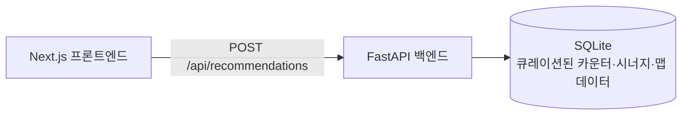

# 🎯 오버워치 밴프준 보조 (ow-counterpick)

> 상대 팀 픽, 우리 팀 픽, 그리고 맵을 입력하면 — 빈 자리에 어떤 영웅을 넣어야
> 할지 근거와 함께 추천해주는 웹 서비스.

공식 오버워치 API가 없어서 실시간 승률 통계 대신, **큐레이션된 카운터/시너지/맵
데이터** 기반으로 추천하는 걸 목표로 하는 개인 포트폴리오 프로젝트입니다.

---

## ✨ 무엇을 해결하나요

밴/픽 단계에서 흔히 겪는 고민을 도와줍니다.

- 상대가 겐지·트레이서를 픽했는데, 우리 팀 마지막 자리에 뭘 넣어야 카운터가 될까?
- 지금 우리 팀 조합(예: 라인하르트+아나)과 시너지 좋은 영웅은?
- 이 맵에서 유독 강하거나 약한 영웅이 있나?

세 가지 점수(카운터·시너지·맵)를 합산해 빈 포지션에 어울리는 영웅을 순위로
보여주고, **왜 추천했는지 근거 문장**을 함께 표시합니다. 데이터가 아직 검토
안 된 조합은 "데이터 없음" 배지로 솔직하게 드러냅니다 (결측치를 억지로
좋은/나쁜 점수로 채우지 않음).

## 🧱 아키텍처



- 런타임에 외부 API 호출이 전혀 없습니다 — 배틀넷 공식 매치 API가 없기 때문에,
  모든 카운터/시너지/맵 평가 데이터는 개발 중 수작업으로 조사해 시드 데이터로
  큐레이션합니다.
- 설계 배경과 점수 계산 로직의 상세 근거는
  [`docs/superpowers/specs/2026-09-07-overwatch-hero-recommender-design.md`](docs/superpowers/specs/2026-09-07-overwatch-hero-recommender-design.md)
  에 정리되어 있습니다.

## 🗂️ 프로젝트 구조

```
.
├── backend/      # FastAPI 서버 (점수 계산 로직 + REST API)
├── frontend/     # Next.js 클라이언트
├── seed-data/    # 큐레이션된 영웅/맵/카운터/시너지 JSON + SQLite 시드 스크립트
└── docs/         # 설계 스펙, API 명세서
```

## 🚀 시작하기

### 백엔드 (FastAPI)

```bash
cd backend
python3 -m venv .venv
source .venv/bin/activate      # Windows: .venv\Scripts\activate
pip install -r requirements.txt

# DB가 없다면 먼저 시드
cd ../seed-data && python3 seed_db.py && cd ../backend

uvicorn app.main:app --reload --port 8000
```

`http://127.0.0.1:8000/docs`에서 Swagger UI로 바로 테스트할 수 있습니다.

### 프론트엔드 (Next.js)

```bash
cd frontend
npm install
npm run dev
```

`http://localhost:3000` 에서 실행됩니다.

### 테스트

```bash
cd backend
source .venv/bin/activate
pytest -v
```

## 📡 API 개요

| 메서드 | 경로 | 설명 |
|---|---|---|
| `GET` | `/api/heroes` | 영웅 목록 조회 |
| `GET` | `/api/maps` | 맵 목록 + 데이터 풍부도 조회 |
| `GET` | `/api/meta` | 시드 데이터 시즌/버전 정보 |
| `POST` | `/api/recommendations` | 빈 포지션에 대한 추천 영웅 순위 조회 |

전체 요청/응답 스키마와 에러 케이스는 [`docs/API명세서.md`](docs/API명세서.md)를
참고하세요.

## 🧪 기술 스택

| 영역 | 기술 |
|---|---|
| 프론트엔드 | Next.js, React, TypeScript |
| 백엔드 | FastAPI, Pydantic |
| 데이터베이스 | SQLite (큐레이션된 시드 데이터, 외부 API 미사용) |
| 테스트 | pytest |

## 🗺️ 로드맵

- [x] MVP: 카운터/시너지/맵 점수 기반 실시간 밴프준 추천
- [ ] 결측치 3단 상태(미검토 / 검토완료-중립 / 검토완료-값있음) 반영
- [ ] 영웅 아이콘 · 아키타입 카테고리 그룹 UI
- [ ] 사전 드래프트 시뮬레이션 모드
- [ ] 통계 기반 매치업 엔진 (충분한 크라우드소싱 데이터 확보 후)

## 📄 라이선스

아직 라이선스가 지정되지 않았습니다.
